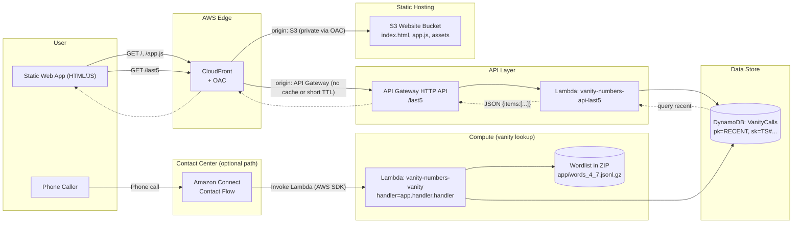

# Vanity Numbers on Amazon Connect

# Overview
This project demonstrates how to extend **Amazon Connect** with a custom vanity number service.  
When a customer calls, their phone number is converted into **vanity word combinations**.  
The system stores the top 5 options in DynamoDB, speaks the top 3 back to the caller, and also exposes them via a simple **web app**.

# Methodology and Word Selection & Scoring Algorithm.

The vanity number generator works by mapping the digits of a caller’s phone number into their T9 keypad equivalents and 
matching those digit patterns against a curated word list (words_4_7.jsonl.gz). The algorithm prioritizes longer matches
first (7, then 6, then 5, down to 4 letters), since these tend to yield more meaningful vanity words. When multiple candidates are available,
a scoring function ranks them: words gain points for length, frequency, and phonetic balance (e.g., inclusion of vowels makes them easier to pronounce).
Penalties are applied for awkward repetitions or non-pronounceable letter combinations. 
This ensures results like 555-356-FLOWERS are chosen ahead of low-value mappings like 555-356-MWDPP.

If no dictionary matches are found, the algorithm falls back to deterministic substitutions by selecting representative 
letters from the T9 digit map, guaranteeing that at least three candidate options are always returned. 
This structure ensures reliability while still preferring meaningful, human-friendly results. 
The process is stateless and repeatable—given the same input number, it will always return the same ranked set of candidates.
---

# Architecture

* Amazon Connect: Invokes the vanity Lambda during a contact flow.
* Lambda (vanity): Parses the caller phone, computes vanity candidates, returns SSML, and writes a compact record to DynamoDB.
* DynamoDB (single table): vanity-numbers-VanityCalls stores “recent” items (sorted by timestamp).
* Lambda (api_last5): Returns the last 5 items for the website.
* API Gateway (HTTP API): Public /last5 endpoint consumed by the site.
* S3 + CloudFront: Hosts index.html and app.js behind a CDN.



# Prerequisites
- AWS CLI v2 with a profile that has Administrator (or equivalent) in your target account.
- Terraform (v1.5+).
- Python 3.12 locally (build uses it).
- Amazon Connect instance ID (for wiring the Lambda to a flow).

# Build & Deploy and helpful commands

```shell
# Build everything
bash build.sh

# Deploy infra (Terraform)
cd infra/terraform
terraform apply --auto-approve -var="connect_instance_id=<ID>"

# Update Lambda code from local zips
aws lambda update-function-code --function-name vanity-numbers-vanity \
  --zip-file fileb://infra/build/lambda_vanity.zip
aws lambda update-function-code --function-name vanity-numbers-api-last5 \
  --zip-file fileb://infra/build/lambda_api.zip

# Invalidate CloudFront cache for site & API path
aws cloudfront create-invalidation --distribution-id <DIST_ID> \
  --paths "/index.html" "/app.js" "/last5"

# Call vanity function directly
aws lambda invoke --function-name vanity-numbers-vanity \
  --cli-binary-format raw-in-base64-out \
  --payload '{"phone":"+15553569377"}' /tmp/vanity.json && cat /tmp/vanity.json

# Hit the API used by the website
curl -s "https://<api-id>.execute-api.us-west-2.amazonaws.com/last5?cb=$(date +%s)" | jq .

# Query last 5 from Dynamo
aws dynamodb query --table-name vanity-numbers-VanityCalls \
  --key-condition-expression 'pk = :p' \
  --expression-attribute-values '{":p":{"S":"RECENT"}}' \
  --no-scan-index-forward --limit 5 | jq .

# Tail logs
aws logs tail /aws/lambda/vanity-numbers-vanity --since 10m
aws logs tail /aws/lambda/vanity-numbers-api-last5 --since 10m
```
S/HTML changes, invalidate CloudFront:
website  - 
```shell
aws cloudfront create-invalidation \
  --distribution-id <DIST_ID> \
  --paths "/index.html" "/app.js" "/last5"
```

# Test

```shell
aws  vanity-numbers % aws lambda invoke \
  --function-name vanity-numbers-vanity \
  --region us-west-2 \
  --cli-binary-format raw-in-base64-out \
  --payload '{"phone":"+15553569377"}' \
  /tmp/vanity.json && cat /tmp/vanity.json
```
Response
```json
{"option1": "555-356-FLOWERS", "option2": "555-356-MWDPP", "option3": "555-356-WDPP", "prompt_ssml": "<speak>Here are your vanity options:<break time=\"250ms\"/><say-as interpret-as=\"characters\">555-356-FLOWERS</say-as><break time=\"250ms\"/><say-as interpret-as=\"characters\">555-356-MWDPP</say-as><break time=\"250ms\"/><say-as interpret-as=\"characters\">555-356-WDPP</say-as>.</speak>"}%   
```
Last 5 API results (sued by the site)
```shell
curl -s "https://<api-id>.execute-api.us-west-2.amazonaws.com/last5?cb=$(date +%s)" | jq .
```
DynamoDB table scan
```shell
aws dynamodb query \
  --table-name vanity-numbers-VanityCalls \
  --key-condition-expression 'pk = :p' \
  --expression-attribute-values '{":p":{"S":"RECENT"}}' \
  --consistent-read \
  --no-scan-index-forward \
  --limit 5 | jq .
```

Result
```json
{
  "Items": [
    {
      "caller_number": "+13033788877",
      "created_at": "2025-10-03T21:59:55.320209+00:00",
      "vanity_candidates": [
        "303-378-TURP",
        "303-378-TTPS",
        "303-378-TTTPP"
      ],
      "raw": [
        { "letters": "TURP", "display": "303-378-TURP", "score": 5.87 },
        { "letters": "TTPS", "display": "303-378-TTPS", "score": 5.35 },
        { "letters": "TTTPP", "display": "303-378-TTTPP", "score": 0 }
      ]
    },
    {
      "caller_number": "+15553569377",
      "created_at": "2025-10-03T21:59:39.090330+00:00",
      "vanity_candidates": [
        "555-356-FLOWERS",
        "555-356-MWDPP",
        "555-356-WDPP"
      ],
      "raw": [
        { "letters": "FLOWERS", "display": "555-356-FLOWERS", "score": 11.84 },
        { "letters": "MWDPP", "display": "555-356-MWDPP", "score": 0 },
        { "letters": "WDPP", "display": "555-356-WDPP", "score": 0 }
      ]
    }
  ],
  "Count": 2
}
```